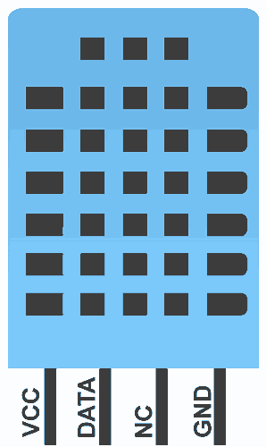

DHT pins
========

Are described [here](http://www.electronicwings.com/sensors-modules/dht11) :



DHT library
===========

I use  the Arduino library for reading the DHT family of temperature and humidity sensors
written by Mark Ruys, <mark@paracas.nl>.

Features
--------
  - Support for DHT11 and DHT22, AM2302, RHT03
  - Auto detect sensor model
  - Low memory footprint
  - Very small code

Usage
-----

```
#include "DHT.h"

DHT dht;

void setup()
{
  Serial.begin(9600);

  dht.setup(2); // data pin 2
}

void loop()
{
  delay(dht.getMinimumSamplingPeriod());

  Serial.print(dht.getHumidity());
  Serial.print("\t");
  Serial.print(dht.getTemperature());
}
```
Also check out the [example] how to read out your sensor. For all the options, see [dht.h][header].

Installation
------------

Place the [DHT][download] library folder in your `<arduinosketchfolder>/libraries/` folder. You may need to create the `libraries` subfolder if its your first library. Restart the Arduino IDE. 

[download]: https://github.com/markruys/arduino-DHT/archive/master.zip "Download DHT library"
[example]: https://github.com/markruys/arduino-DHT/blob/master/examples/DHT_Test/DHT_Test.pde "Show DHT example"
[header]: https://github.com/markruys/arduino-DHT/blob/master/DHT.h "Show header file"

